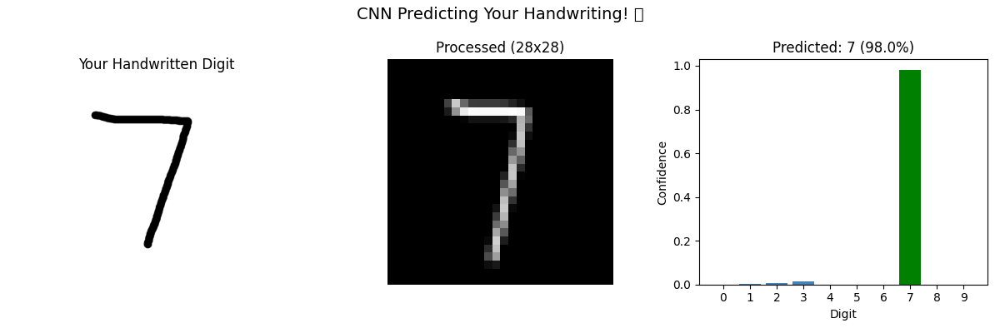

#  Handwritten Digit Recognition using CNN

## Overview
An AI model that recognizes handwritten digits (0-9) 
using Convolutional Neural Networks trained on MNIST dataset.

## Results
- Test Accuracy: 98.81%
- Dataset: MNIST (60,000 training, 10,000 test images)
- Model: CNN with 2 Conv layers + MaxPooling + Dense layers

## Tech Stack
- Python
- TensorFlow / Keras
- NumPy
- Matplotlib

## What it does
- Loads and preprocesses MNIST dataset
- Trains CNN model with 5 epochs
- Achieves 98.81% test accuracy
- Predicts on real handwritten digit photos
- Visualizes predictions with confidence scores
- Confusion matrix for full evaluation

## Screenshots

## Skills Learned
- Deep Learning (CNN architecture)
- Image preprocessing
- Model training and evaluation
- Real world image testing
